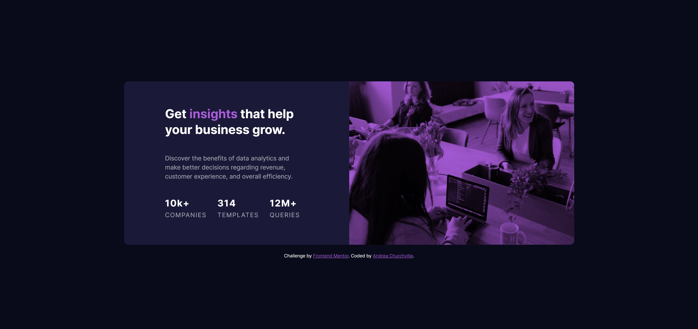

# Frontend Mentor - Stats preview card component solution

This is a solution to the [Stats preview card component challenge on Frontend Mentor](https://www.frontendmentor.io/challenges/stats-preview-card-component-8JqbgoU62). Frontend Mentor challenges help you improve your coding skills by building realistic projects.

## Table of contents

- [Overview](#overview)
  - [The challenge](#the-challenge)
  - [Screenshot](#screenshot)
- [My process](#my-process)
  - [Built with](#built-with)
  - [What I learned](#what-i-learned)
  - [Continued development](#continued-development)
- [Author](#author)

## Overview

### The challenge

Users should be able to:

- View the optimal layout depending on their device's screen size

### Screenshot

## My process

### Built with

- HTML/ CSS
- Flexbox
- SCSS

### What I learned

I got a little bit familiar with SCSS and Flexbox. I focused on designing mobie view first and changing elements around for desktop.

### Continued development

I want to do more practice with Flexbox and responsive design to really soldify with what I've learned.

## Author

- Website - [Andrea Churchville](http://andreachurchville.squarespace.com/)
- Frontend Mentor - [@AndChurchville](https://www.frontendmentor.io/profile/AndChurchville)
- Twitter - [@Andchurchville](https://twitter.com/AndChurchville)
